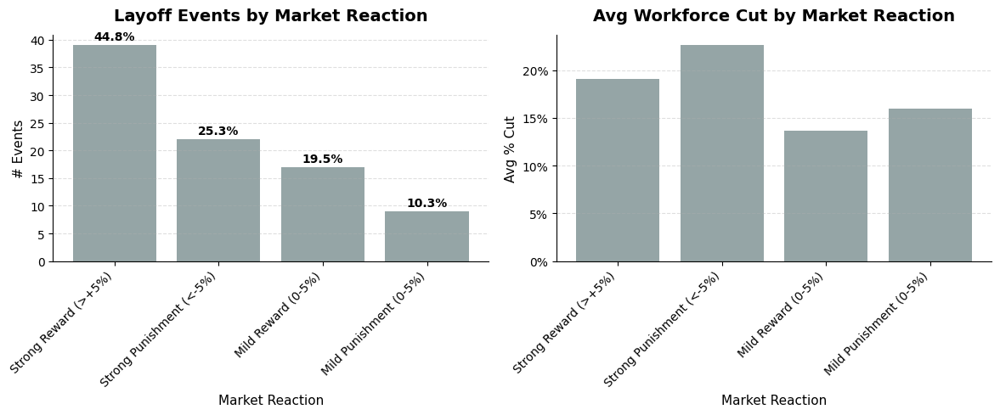
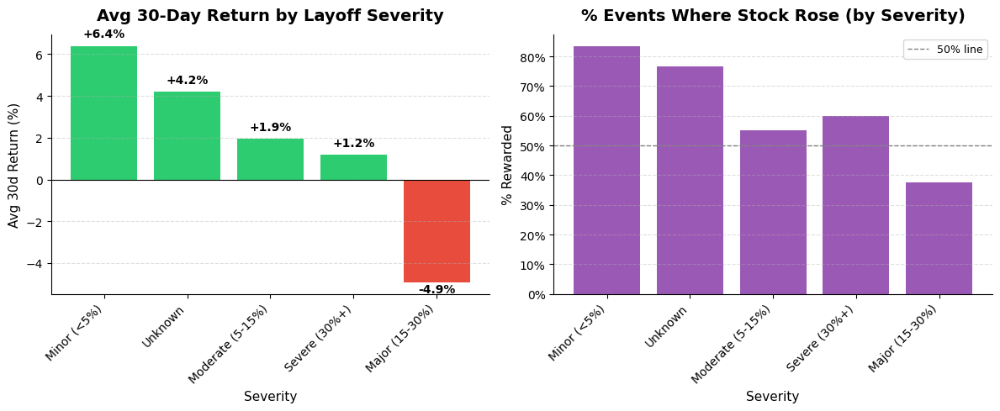
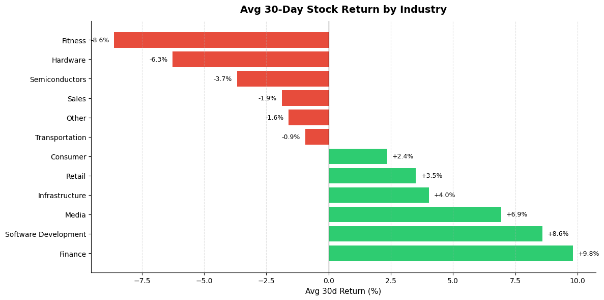
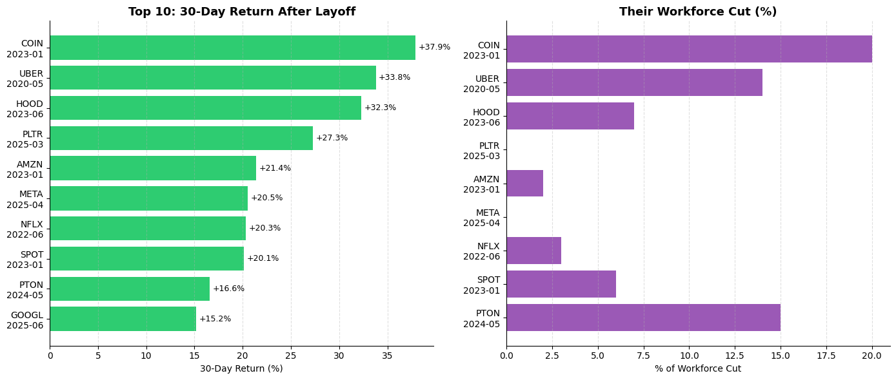
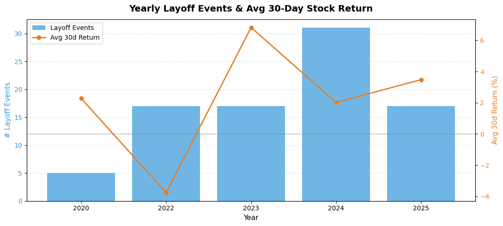
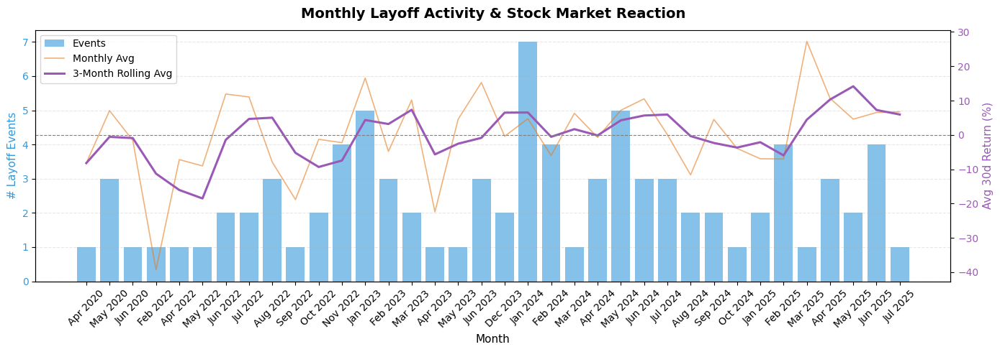

# FintechPulse: Do Tech Layoffs Reward or Punish Companies on the Stock Market?

An end-to-end data pipeline built with Python, Databricks, dbt, and Spark SQL to answer one genuinely interesting question:

> **When a tech company announces mass layoffs, does its stock price go up or down in the 30 days that follow?**

---

## The Answer: The Market Mostly Rewards Layoffs



**44.8% of layoff announcements triggered a Strong Reward (>+5%)** — the single most common outcome. Only 1 in 4 events resulted in a strong punishment. Companies announcing layoffs that cut the largest share of their workforce (~22% avg) also saw the strongest punishments, suggesting the market distinguishes between strategic restructuring and distress-driven cuts.

---

## Does the Size of the Cut Matter?



Yes — but not in the way you'd expect. **Minor cuts (<5%) produced the best average 30-day return at +6.4%**, and over 80% of those events were rewarded. The Major tier (15–30% cuts) was the only category to average a negative return at **-4.9%**, with less than 40% of events resulting in a stock gain. This suggests investors read large cuts as a distress signal rather than efficiency.

---

## Which Industries Benefit Most?



Finance and Software Development companies saw the strongest average post-layoff returns at **+9.8% and +8.6%** respectively — the market appears to treat headcount reduction in these sectors as margin expansion. Fitness and Hardware companies were punished hardest (-8.6% and -6.3%), consistent with those industries facing structural demand problems, not just cost bloat.

---

## The Biggest Individual Winners



**Coinbase (COIN) in January 2023** tops the list with a **+37.9% return** after cutting 20% of its workforce — the largest cut in the top 10. Uber's May 2020 announcement followed at +33.8%. Notably, several companies in the top 10 (META, NFLX, GOOGL) made relatively small workforce cuts but still saw 20%+ returns, reinforcing that cut size alone doesn't drive reward.

---

## Year-over-Year Trend



Layoff volume peaked in **2024 with 31 events**, but the best average market reaction came in **2023 at ~+6.3%** — the year the market most consistently rewarded restructuring. 2022 was the worst year for post-layoff returns, averaging negative, coinciding with the broader tech selloff where macro pressure made it hard for any signal to cut through.

---

## Monthly Activity & Rolling Trend



The 3-month rolling average (purple) stayed consistently above zero for most of the dataset, with dips in early 2022 and brief spikes around January 2024 (7 events — the busiest single month). The trend through 2024–2025 shows the rolling average stabilising around +5–10%, suggesting the market has become increasingly accustomed to treating layoffs as a positive signal.

---

## Stack

| Layer | Tool |
|---|---|
| Data cleaning | Python (pandas, numpy) |
| Stock prices | yfinance (free, no API key) |
| Cloud platform | Databricks Community Edition |
| Transformations | dbt (dbt-databricks) |
| Analysis | Spark SQL |
| Visualisations | matplotlib |

---

## How to Run

```bash
git clone https://github.com/joeguy57/fintech-pulse.git
cd fintech-pulse
python -m venv venv && source venv/bin/activate
pip install pandas numpy yfinance dbt-databricks

python python/01_clean.py       # clean raw data
python python/02_enrich.py      # add stock prices (takes a few mins)
```

Upload the two CSVs to Databricks (`hive_metastore.fintech_pulse`), then:

```bash
cd fintech_pulse
dbt run && dbt test
```


---

## Data Sources

- **Layoffs:** [Tech layoffs 2020–2025 by Ulrike Herold](https://www.kaggle.com/datasets/ulrikeherold/tech-layoffs-2020-2024) — ODbL licence
- **Stock prices:** Yahoo Finance via `yfinance`